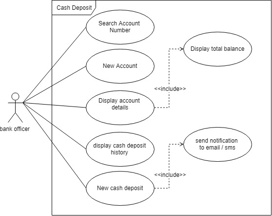
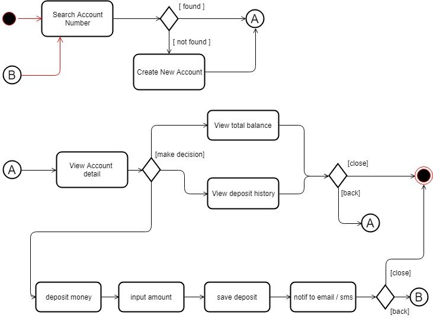
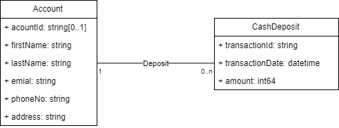
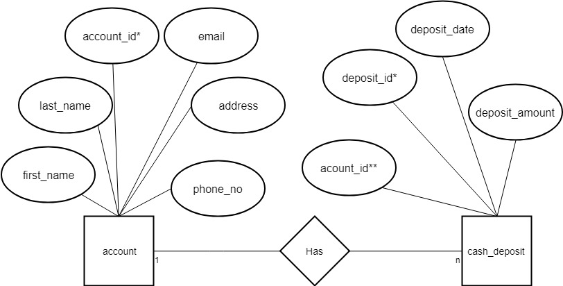

# Cash Deposit

Aplikasi Cash Deposit untuk T.N Assignment.

- [Rancangan Aplikasi](#rancangan-aplikasi)
  - [Usecase Diagram](#usecase-diagram)
  - [Activity Diagram](#activity-diagram)
  - [Class Diagram](#class-diagram)
  - [ER Diagram](#er-diagram)
- [Install Dependency](#install-dependency)
- [Run Aplication](#run-aplication)
- [Route untuk Backend](#route-untuk-backend)
  - Accounts
    - [List Accounts](#list-accounts)
    - [Single Account](#single-account)
    - [New Account](#new-account)
  - Cash Deposit
    - [List Deposits](#list-deposits)
    - [List Deposits By Account](#list-deposits-by-account)
    - [Total Balance](#total-balance)
    - [New Cash Deposit](#new-cash-deposit)
- [Route untuk Frontend](#route-untuk-frontend)
- [Database Schema](#database-schema)
- [Mail Trap](#mail-trap)

## Rancangan Aplikasi

### Usecase Diagram

Rancangan Usecase diagram sebagai berikut



### Activity Diagram

Rancangan Activity diagram sebagai berikut



### Class Diagram

Rancangan Class diagram sebagai berikut



### ER Diagram

Rancangan ER diagram sebagai berikut



## Install Dependency

Pertama buat database menggunakan database `postgresql`. Untuk instruksi nya bisa di lihat pada bagian [Database Schema](#database-schema). Setelah database di buat, pastikan konfigurasi nya sesuai, dapat di robah pada file [config.yml](config.yml).

install dependency menggunakan `dep`

```sh
dep ensure
```

## Run aplication

Pertama `cd /to/path`, lalu

```sh
go run main.go
```

Setelah aplikasi backend jalan, selanjut nya jalankan aplikasi [Forntend](https://github.com/muhammadaser/cash_deposit_frontend).

## Route untuk Backend

Route untuk backend seperti berikut :

### Accounts

#### List Accounts

Menggunakan route

```url
GET /cash-deposit/v1/accounts
```

#### Single Account

Menggunakan route

```url
GET /cash-deposit/v1/accounts/{accountID}
```

#### New Account

Menggunakan route

```url
POST /cash-deposit/v1/accounts
```

body

```json
{
    "account_id":"03212546",
    "first_name":"Jhone",
    "last_name":"Doe",
    "email":"jhone.doe@gmail.com",
    "phone_no":"085263123456",
    "address":"Jakarta"
}
```

### Cash Deposit

#### List Deposits

Menggunakan route

```url
GET /cash-deposit/v1/deposits
```

#### List Deposits By Account

Menggunakan route

```url
GET /cash-deposit/v1/deposits/account/{accountID}
```

#### Total Balance

Menggunakan route

```url
GET /cash-deposit/v1/deposits/account/{accountID}/balance
```

#### New Cash Deposit

Menggunakan route

```url
POST /cash-deposit/v1/deposits
```

body

```json
{
    "deposit_id":"201808013849",
    "account_id":"03212546",
    "deposit_amount":100000
}
```

## Route untuk Frontend

Berikut Route untuk Frontend :

- [Root or Home](#root-or-home)
- [Detail Account](#detail-account)
- [New Account](#new-account)
- [Deposit History](#deposit-history)
- [Cash Deposit](#cash-deposit-nasabah)

### Root or Home (`/`)

Root atau home merupakan halaman awal dari aplikasi. Pada halaman ini terdapat form pencarian _account number_. Pencarian akan menampilkan daftar _account number_ yang ada didalam database.

Jika data yang dicari belum terdaftar, maka pengguna dapat membuat account baru dengan mengklik tombol **New Account**.

```sh
 ---------------------------         ------
|Account Number ...         |       | cari |
 ---------------------------         ------

 -----------
|New Acount |
 -----------

| Account Number | Full Name | Action |
| -------------- |:---------:|-------:|
| 03292827       |Jhone Doe  | Detail |
| 03292828       |Jhone Doe 1| Detail |
| 03292829       |Jhone Doe 2| Detail |
| 03292830       |Jhone Doe 3| Detail |
| 03292831       |Jhone Doe 4| Detail |
```

### Detail Account

```url
/{acount_id}/detail
```

Detail Account merupakan halaman ketika detail di klik. Halaman ini menampilkan detail dari acount yang di pilih. Selain menampilkan detail account seperti nama, alamat, email, dan phone no, halaman ini juga menampilkan _total balance_ dari pemilik acoount.

Saat berada didalam halaman ini, pengguna bisa membuat _cash deposit_ baru atau melihat _deposit history_.

### New Account

```url
/new-account
```

New Account merupakan halaman untuk membuat account baru bagi nasabah yang belum memiliki account didalam sistem. Halaman ini memungkinkan pengguna untuk memasukan data-data seperti First Name, Last Name, email, phone_no, address etc. Setelah pembuatan account baru, pengguna akan di arahkan ke halaman [detail account](#detail-account).

### Deposit History

```url
/{account_id}/deposit-history
```

Halaman Deposit History merupakah halaman yang menampilkan history dari transaksi *cash deposit*.

### Cash Deposit Nasabah

```url
/{account_id}/cash-deposit
```

Halaman Cash Deposit merupakan halaman untuk transaksi deposit uang ke bank. Halaman ini menampilkan form inputan untuk deposit uang ke account nasabah.

## Database Schema

Pertama buatlah database dengan nama `deposit`. Setelah itu buat tabel pada schema public dengan memasukan script berikut.

```sql
CREATE TABLE account (
    account_id character varying(16) NOT NULL,
    first_name character varying(128),
    last_name character varying(128),
    email character varying(256),
    phone_no character varying(16),
    address character varying(256)
);

CREATE TABLE cash_deposit (
    deposit_id character varying(32) NOT NULL,
    account_id character varying(16),
    deposit_date timestamp without time zone,
    deposit_amount bigint
);

ALTER TABLE ONLY account
    ADD CONSTRAINT account_pkey PRIMARY KEY (account_id);

ALTER TABLE ONLY cash_deposit
    ADD CONSTRAINT cash_deposit_pkey PRIMARY KEY (deposit_id);

ALTER TABLE ONLY cash_deposit
    ADD CONSTRAINT fk_cash_deposit_account FOREIGN KEY (account_id) REFERENCES account(account_id) ON UPDATE CASCADE ON DELETE CASCADE;

INSERT INTO  account (account_id, first_name, last_name, email, phone_no, address) VALUES
('03212546', 'Jhone', 'Doe', 'jhone.doe@gmail.com', '085263123456', 'Jakarta'),
('03253548', 'Nathan', 'Dyer', 'nathan.dyer@gmail.com', '085263123457', 'Jakarta');

```

## Mail Trap

untuk kirim notif ke email, saya menggunakan mail trap, untuk masuk ke halamn mail trap, bisa melalui url [mailtrap.io](https://mailtrap.io/signin). Gunakan username : `muhammadaser@gmail.com` dan password `12345678` untuk masuk ke halaman dashboard mailtrap.